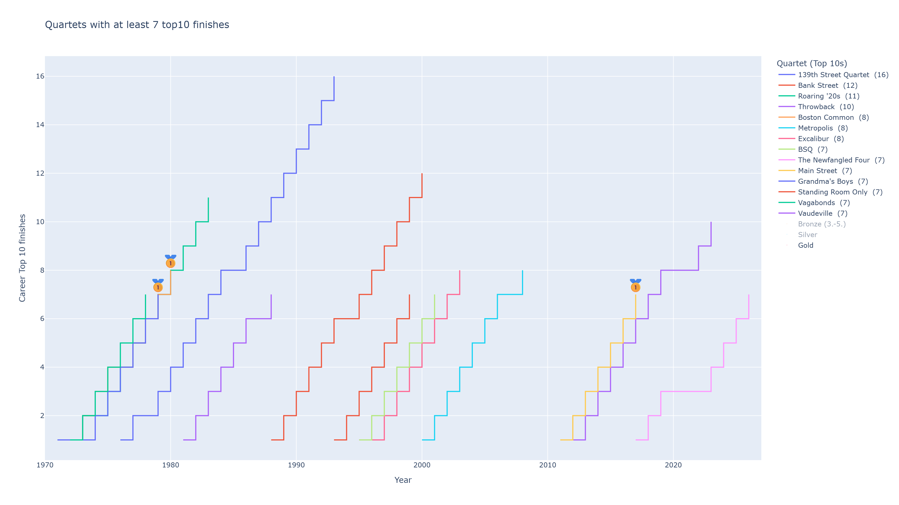
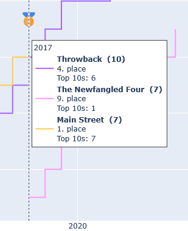

# Barbershop

## Top 10 finishes

### Motivation

With the recent top10 finish, the Newfangled Four have managed yet another top 10 finish.
This raises the question: Are they a top contender for the quartet with the most top-level longevity?
How many other quartets have managed to get a top10 finish this many times?

### Methodology

Data was taken from [barbershopwiki.com](https://www.barbershopwiki.com). This wiki page contains results for each year (e.g. for [1981](https://www.barbershopwiki.com/wiki/BHS_Intl_Quartet_Contest_1981)).
Top 10 results were copied and put into a pandas dataframe friendly format (tsv). 
Each year has its own file in `top10scores/`, e.g. `top10scores/1986.tsv`.
The data was used to create a temporal graph to display the number of top10 finishes by quartet.

### Functionalities

Hovering shows all quartets on the current x axis with some information.
Medals can be displayed on the chart and toggled in the legend.
Number of total top10 placements are shown in the legend and are sorted.

### Example 

All quartets with at least 7 top10 finishes since the 1970s is displayed here. 
Only gold medals are toggled on. \

Hoverbox showing all relevant quartets that year \

